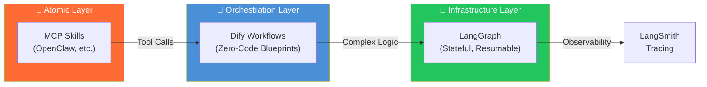

# 

### _2026 Industrial-Grade AI Productivity Matrix_

---

---

## 🏗️ The AIwork4me Production Matrix

> **Three-Layer Architecture for Enterprise AI Solutions**

| Layer | Repository | Role | Key Technologies |
|:-----:|:-----------|:-----|:-----------------|
| 🦾 **Atomic** | [Awesome-Claude-Agent-Skills](https://github.com/AIwork4me/Awesome-Claude-Agent-Skills) | **The Muscles** — MCP-compliant atomic skills | `Bun` `TypeScript` `MCP 2026` `Deep Agent` |
| 🔗 **Orchestration** | [Awesome-Dify-Workflows](https://github.com/AIwork4me/Awesome-Dify-Workflows) | **The Nervous System** — Zero-code business blueprints | `Dify DSL` `Reflection Pattern` `Quality Gates` |
| 🧠 **Infrastructure** | [Awesome-LangChain-Enterprise](https://github.com/AIwork4me/Awesome-LangChain-Enterprise) | **The Core Engine** — Cognitive resilience backbone | `LangGraph` `HITL` `LangSmith` `Stateful` |

### 📊 Architecture Flow

---

## 🚀 Capability Stack

### 🧠 Cognitive Layer

### 🛠️ Execution Layer

### 🌐 Distribution Layer

---

## 📈 Production Stats

  

  

---

## 📝 Latest Blog Posts

> 💡 **Learn how to build these autonomous agents on my WeChat OA.**

<!-- BLOG-POST-LIST:START -->
- 📌 [两步搞定！在 Windows 上安装 Claude Code + GLM-5：告别封号，腰斩费用！](https://mp.weixin.qq.com/s/4IaWYsMlZkmoq0JpkmlzBw)
- 📌 [别守办公桌了！三步用飞书远程 "遥控" OpenClaw](https://mp.weixin.qq.com/s/Cdzw2O2IoAk9pmbjOuUK5A)
<!-- BLOG-POST-LIST:END -->

---

## 🔗 Quick Links

| Resource | Description |
|:---------|:------------|
| 🦾 [Skill Factory](https://github.com/AIwork4me/Awesome-Claude-Agent-Skills) | MCP skills with 60-second scaffolding |
| 🔗 [Workflow Blueprints](https://github.com/AIwork4me/Awesome-Dify-Workflows) | Production-ready Dify DSL workflows |
| 🧠 [Cognitive Backbone](https://github.com/AIwork4me/Awesome-LangChain-Enterprise) | Enterprise LangGraph patterns |
| 📱 [WeChat OA](#-stay-connected) | Real-time tutorials & updates |

---

## 📱 Stay Connected

**Scan to Follow「AI替我干活」**

*Get exclusive tutorials on Deep Agent Skills & MCP Protocol.*

---

### 🛡️ 2026 Deep Agent Standard

`Self-Healing` | `Progress-Aware` | `Security-First`

---

**Let AI work for me.**

*© 2026 AIwork4me. Powered by Autonomous Agents.*

